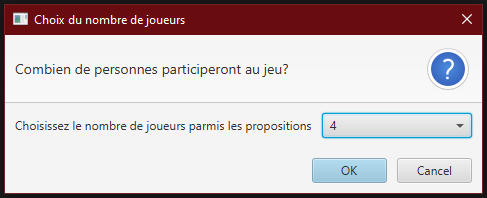
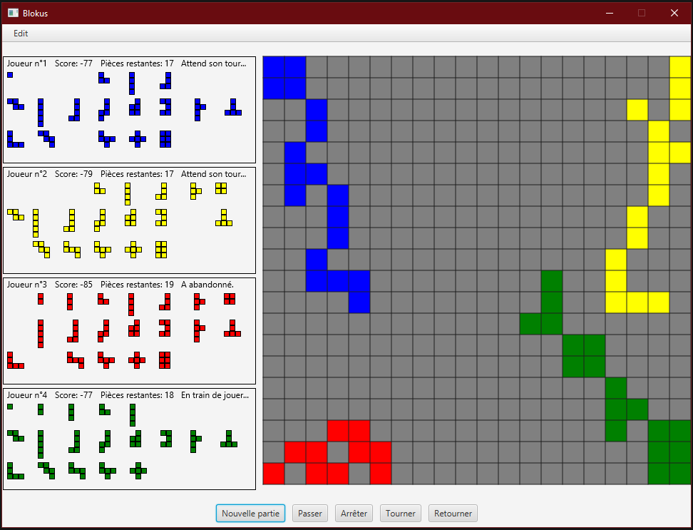
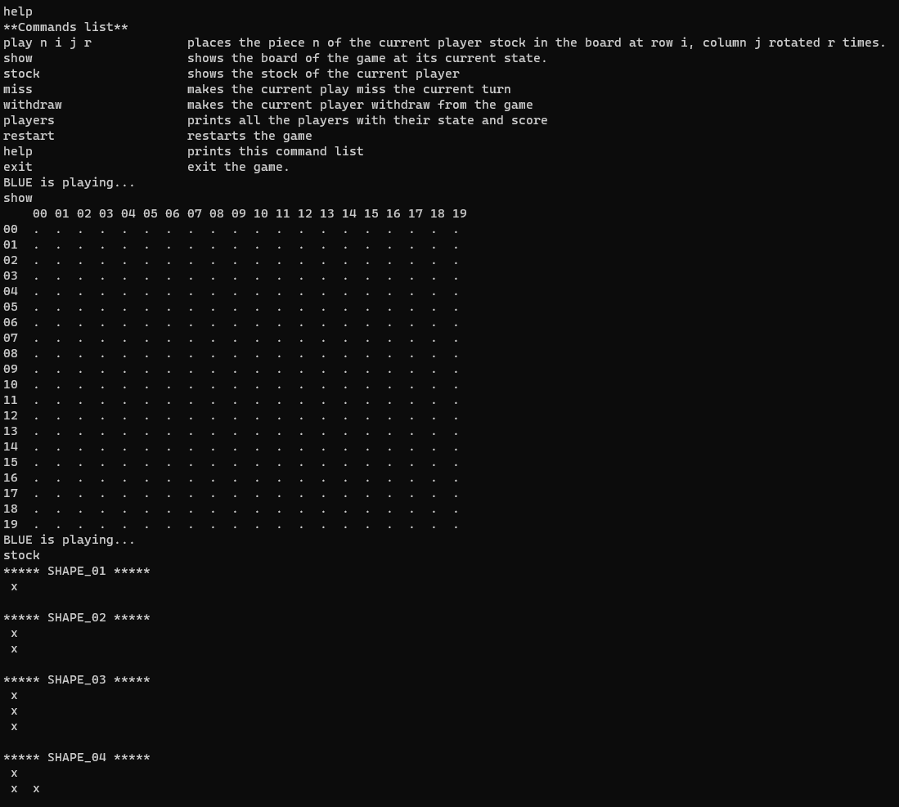

# Blokus

This a Java implementation of a board game called [*Blokus*](https://en.wikipedia.org/wiki/Blokus).

From Wikipédia, *Blokus is an abstract strategy board game for two to four players, where players try to score points by occupying most of the board with pieces of their colour. It was invented by Bernard Tavitian and first released in 2000 by Sekkoïa, a French company. It has won several awards, including the Mensa Select award and the 2004 Teacher's Choice Award. In 2009, the game was sold to Mattel*.

## About
I developed this game during the second year (december 2018) of my Bachelor's degree in Computer Science. This was an assignment for a course about the fundamentals of Software Development using Java.  The course followed a first theoretical course about the Java programming language. During this unit, we have learned:
 - Object oriented programming fundamentals
 - Lambdas
 - Generics
 - How to develop graphical user interface using JavaFX.
 
This project was the occasion to apply what we had learned during the semester.

### How to use

#### Graphical user interface
The project compiles using maven so make sure to install it in order to use this project. Once the tool installed, You can build and run the
project by executing the following command in the project root: `mvn clean javafx:run`.

##### Screenshots

The game starts by asking you how many players are taking part to the current game. It was assumed the all the players would be using the same machine. If the number of selected players is less than 4 (maximum) then some artificial players are participating instead of the lacking players. 

#### Command Line Interface
The CLI interface is a bit complexe to use. Its objective was to have a way to interact with the game before implementing the GUI. You execute the CLI by running `mvn compile exec:java -Dexec.mainClass="blokus.BlokusConsole"`.

##### Screenshot

